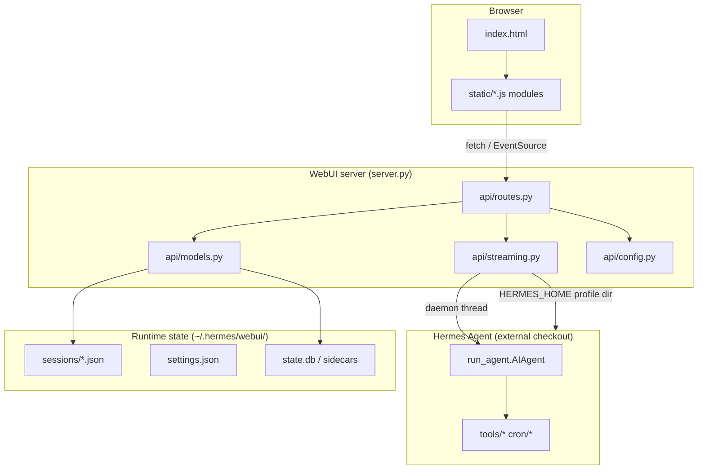
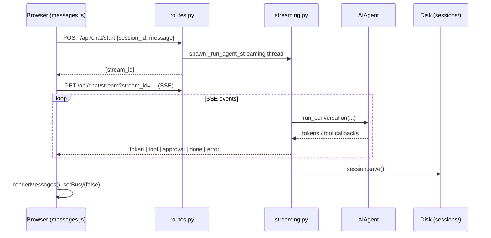

# Hermes WebUI — Agent Knowledge Base

> **Purpose:** Single onboarding map for humans and AI agents before touching code.
> Use this file to understand architecture, state layers, test harness behavior, and
> where to look next. Update it when you learn something durable about the repo.
>
> **Last verified:** 2026-07-02 against repo `master` (5892 pytest tests collected).

---

## How to use this document

1. Read this file end-to-end on first visit.
2. Follow the linked canonical docs for subsystem depth.
3. Before a change, fill in the **Contract Routing** block (bottom) in your task notes.
4. After completing work, update sections here only if you discovered durable facts
   missing from `ARCHITECTURE.md`, `TESTING.md`, or `docs/CONTRACTS.md`.

**Entry points elsewhere:**

| Doc | Role |
|-----|------|
| [`AGENTS.md`](../AGENTS.md) | Safety rules, read-first list, isolated trial commands |
| [`ARCHITECTURE.md`](../ARCHITECTURE.md) | Deep module/API reference, ADRs, critical rules |
| [`TESTING.md`](../TESTING.md) | Manual browser test plan |
| [`docs/CONTRACTS.md`](CONTRACTS.md) | RFC/contract routing index |
| [`BUGS.md`](../BUGS.md) | Open limitations and fixed-bug history |
| [`CONTRIBUTING.md`](../CONTRIBUTING.md) | PR expectations and verification |

---

## 1. What this repository is

Hermes WebUI is a **self-hosted browser interface** for [Hermes Agent](https://hermes-agent.nousresearch.com/).
It targets **CLI parity**: chat, sessions, workspace files, cron, skills, memory, profiles,
onboarding, and streaming tool execution — all without a frontend build step.

**Stack constraints (do not violate without explicit approval):**

- Python stdlib HTTP server (`ThreadingHTTPServer`) + modular `api/` package
- Vanilla JavaScript modules in `static/` (no React/Vue/bundler)
- Hermes Agent imported at runtime via `sys.path` (sibling checkout or `~/.hermes/hermes-agent`)
- Runtime state lives **outside** the repo under `~/.hermes/webui/` by default

---

## 2. Repository layout (mental map)

```
hermes-webui/
├── server.py              # Thin HTTP shell: auth middleware, dispatch, TLS, logging
├── bootstrap.py           # First-run launcher: discover agent, deps, open browser
├── start.sh / ctl.sh      # Shell wrappers (foreground vs daemon)
├── api/                   # All backend business logic
│   ├── routes.py          # Route handlers (largest module — GET/POST surface)
│   ├── streaming.py       # SSE engine, AIAgent invocation, cancel/compress
│   ├── models.py          # Session CRUD, sidecar/state.db, CLI bridge
│   ├── config.py          # Discovery, env, model/provider catalog, globals
│   ├── profiles.py        # Multi-profile HERMES_HOME switching
│   ├── onboarding.py      # First-run wizard + provider writes
│   ├── workspace.py       # File tree, safe path resolution, git badge
│   ├── auth.py            # Optional password + signed cookies
│   └── …                  # Specialized: turn_journal, recovery, providers, etc.
├── static/
│   ├── index.html         # App shell + script load order
│   ├── style.css          # All CSS (themes/skins/mobile)
│   ├── ui.js              # DOM helpers, markdown, tool cards, global `S` state
│   ├── sessions.js        # Sidebar session list, search, projects, recovery
│   ├── messages.js        # send(), SSE handlers, approval, streaming transcript
│   ├── panels.js          # Control Center, cron/skills/memory/settings
│   ├── workspace.js       # Right-panel file browser + preview
│   ├── commands.js        # Slash command autocomplete
│   ├── boot.js            # Boot IIFE, mobile nav, voice, theme sync
│   └── onboarding.js      # First-run overlay
├── tests/
│   ├── conftest.py        # Isolated server fixture, network guards, discovery
│   ├── test_regressions.py# Permanent regression gate (one test per reintroduced bug)
│   ├── test_sprint*.py    # Historical sprint HTTP integration tests
│   └── test_issue*.py     # Issue/PR-pinned regression tests (~500+ files)
└── docs/                  # Contracts, onboarding, Docker, RFCs
```

---

## 3. Architecture diagram

### 3.1 Process topology



### 3.2 Chat round trip (happy path)



**Key invariant:** `send()` captures `activeSid` **before** any `await`. On completion,
results apply only if `S.session.session_id === activeSid` (prevents cross-session clobber).

---

## 4. Backend subsystems

### 4.1 HTTP layer (`server.py`)

- `ThreadingHTTPServer` — one thread per request (acceptable for single-user/self-hosted).
- Handler delegates to `api/routes.py` for all `/api/*` and static/template routes.
- **Critical ordering:** in POST dispatch, `/api/upload` must be handled **before**
  `read_body()` — multipart and JSON body share `rfile` (see ARCHITECTURE §4.1).

### 4.2 Sessions (`api/models.py`)

- Session = JSON file at `{STATE_DIR}/sessions/{session_id}.json`
- In-memory `SESSIONS` cache (OrderedDict LRU, cap 100) + `_index.json` for O(1) listing
- Sidecar / `state.db` reconciliation for durability metadata (message counts, run state)
- CLI session bridge imports from Hermes Agent SQLite store

### 4.3 Streaming (`api/streaming.py`)

- `POST /api/chat/start` → creates `queue.Queue` in `STREAMS`, starts daemon thread
- `GET /api/chat/stream` → long-lived SSE; heartbeats every 30s
- Sets per-run env: `TERMINAL_CWD`, `HERMES_EXEC_ASK`, `HERMES_SESSION_KEY`, `HERMES_HOME`
- **Known debt:** process-global env vars — concurrent different-session runs can race (#195)

### 4.4 Config & discovery (`api/config.py`)

Auto-discovers:

| Resource | Order |
|----------|-------|
| Agent dir | `HERMES_WEBUI_AGENT_DIR` → `~/.hermes/hermes-agent` → sibling `../hermes-agent` |
| Python | Agent venv → repo `.venv` → system `python3` |
| State dir | `HERMES_WEBUI_STATE_DIR` → `~/.hermes/webui` |
| Workspace | `HERMES_WEBUI_DEFAULT_WORKSPACE` → `~/workspace` |

### 4.5 Workspace trust model (`api/workspace.py`)

Two functions — **do not collapse**:

- `validate_workspace_to_add()` — permissive (user explicitly registers a path)
- `resolve_trusted_workspace()` — strict for read/write (must be registered or under home)

---

## 5. Frontend subsystems

Scripts load in dependency order from `index.html` (not ES modules except vendored smd).

| Module | Owns |
|--------|------|
| `ui.js` | Global `S` state, `api()`, `renderMd`, tool cards, composer chrome |
| `sessions.js` | Sidebar list, pin/archive/projects, reload recovery, `deleteSession` rules |
| `messages.js` | `send()`, EventSource, approval/clarify SSE, INFLIGHT guard |
| `workspace.js` | File tree, preview modes (code/md/image/pdf/media) |
| `panels.js` | Hermes Control Center, cron/skills/memory/profiles/settings |
| `commands.js` | Slash autocomplete registry |
| `boot.js` | Mobile sidebar, voice input, theme/skin, panel state machine |

**Global client state (`S` in ui.js):**

```javascript
S = { session, messages, entries, busy, pendingFiles, … }
INFLIGHT = { [session_id]: { messages snapshot, uploaded files } }
```

**Themes:** axis = `light | dark | system`; skins = `default | ares | mono | …` via
`data-skin` + `.dark` class (not legacy `data-theme` alone).

---

## 6. State layers (what mutates what)

When changing runtime/recovery/streaming behavior, name which layer you touch:

| Layer | Location | Holds |
|-------|----------|-------|
| Session JSON | `sessions/{id}.json` | messages[], title, workspace, model, flags |
| Session index | `sessions/_index.json` | compact metadata for sidebar list |
| WebUI settings | `settings.json` | theme, send key, password hash, toggles |
| Workspaces registry | `workspaces.json` | named workspace paths |
| Profile homes | `~/.hermes/profiles/*` or profile-scoped `HERMES_HOME` | config.yaml, .env, skills |
| Sidecar / state.db | under state dir | run metadata, reconciliation |
| Turn journal | append-only audit (RFC) | crash-safe turn lifecycle |
| Browser localStorage | client only | last session id, INFLIGHT, panel widths, theme |

**Safety for agents:** use isolated dirs unless the human explicitly approves real state:

```bash
HERMES_HOME=/tmp/hermes-webui-agent-home \
HERMES_WEBUI_STATE_DIR=/tmp/hermes-webui-agent-state \
HERMES_WEBUI_PORT=8789 \
python3 bootstrap.py
```

---

## 7. Test infrastructure

### 7.1 Quick commands

```bash
# Full suite (CI parity)
pytest tests/ -v --timeout=60

# Regression gate only
pytest tests/test_regressions.py -v

# Single issue test
pytest tests/test_issueXXXX_description.py -v

# Collect count
pytest tests/ --collect-only -q
```

**Current scale:** 11,781 tests across ~700 files (grows with each issue/PR pin).

### 7.2 How tests drive the server

`tests/conftest.py` is the control plane:

1. **Derives isolated port** (20000–29999 hash of repo path) unless `HERMES_WEBUI_TEST_PORT` set
2. **Derives isolated state dir** `~/.hermes/webui-test-{hash}` unless pinned
3. **Session-scoped `test_server` fixture (autouse):**
   - Wipes test state dir
   - Spawns `server.py` subprocess with test env vars
   - Waits for `/health`
   - Tears down on session end
4. **Never touches production** port 8787 or real `~/.hermes/webui` when env overrides apply

Tests import `BASE` from `tests/_pytest_port.py` for HTTP calls (urllib, not requests).

### 7.3 Hermeticity guards (important)

| Guard | Purpose |
|-------|---------|
| Socket monkey-patch | Blocks outbound non-localhost sockets in pytest process |
| `HERMES_WEBUI_TEST_NETWORK_BLOCK=1` | Same block inside server subprocess |
| `AWS_EC2_METADATA_DISABLED=true` | Prevents slow IMDS probes via botocore |
| `os.execv` no-op | Prevents update-restart daemon from re-execing pytest |
| Autouse strip `HERMES_WEBUI_SKIP_ONBOARDING` | Onboarding tests get real wizard paths |

Opt-in: `allow_outbound_network` fixture (rare; prefer mocks).

### 7.4 Test file naming patterns

| Pattern | Meaning |
|---------|---------|
| `test_sprintN.py` | Sprint-era HTTP integration batches |
| `test_issueNNNN_*.py` | GitHub issue regression pin |
| `test_NNN_*.py` | Issue number shorthand |
| `test_regressions.py` | Permanent gate — **run before/after risky edits** |
| `test_*_static.py` | Assert on static file contents (no live agent) |
| `@requires_agent` / auto-skip list | Skips when hermes-agent checkout missing |

Many tests are **static analysis** (grep HTML/JS/CSS) or **HTTP against mockable endpoints**.
Agent-dependent tests (cron, skills, live SSE) skip when `hermes-agent` is not installed.

### 7.5 CI (`.github/workflows/tests.yml`)

- Triggers: PR and push to `master`
- Matrix: Python 3.11, 3.12, 3.13 on `ubuntu-latest`
- Installs: `pyyaml`, `pytest`, `pytest-timeout`, `pytest-asyncio`, optional `mcp`
- Command: `pytest tests/ -v --timeout=60`
- **Note:** CI does not install full Hermes Agent — agent-dependent tests skip gracefully

### 7.6 Manual testing

Automated tests cannot cover all UX. Use [`TESTING.md`](../TESTING.md) for:

- Visual/CSS regressions
- Live agent tool approval flows
- SSE reconnect timing
- Mobile responsive layout
- Multi-session concurrent switching

---

## 8. Bootstrap & operations

| Command | Use |
|---------|-----|
| `python3 bootstrap.py` | First run: discover agent, deps, health wait, browser |
| `./start.sh` | Shell wrapper around bootstrap |
| `./ctl.sh start\|stop\|status\|logs` | Daemon lifecycle for homelab |
| `curl http://127.0.0.1:8787/health` | Liveness + session/stream stats |

Logs:

- `~/.hermes/webui/bootstrap-{port}.log` — foreground/start.sh
- `~/.hermes/webui.log` — ctl.sh daemon

Docker: see [`docs/docker.md`](docker.md). Known #681: two-container setup runs tools in WebUI container.

---

## 9. Critical rules (do not regress)

Copied from ARCHITECTURE §17 — violations have been fixed multiple times:

| ID | Rule |
|----|------|
| R1 | `deleteSession()` **never** calls `newSession()` |
| R2 | `/api/upload` before `read_body()` in POST dispatch |
| R3 | `run_conversation(..., task_id=…)` not `session_id=` |
| R4 | `stream_delta_callback` may receive `None` sentinel — guard it |
| R5 | `send()` captures `activeSid` before any `await` |
| R6 | Boot must **not** auto-create a session (only `+` button or first send) |
| R7 | All `SESSIONS` dict access under `LOCK` |
| R8 | No tracebacks in API 500 responses |
| R9 | Approvals iterate `pattern_keys` (plural), not legacy singular only |

---

## 10. Open limitations (pre-integration checklist)

From [`BUGS.md`](../BUGS.md) — verify impact before data integration work:

1. **#195 — os.environ race** under concurrent multi-session agent runs
2. **#681 — Docker two-container** tools execute in WebUI container filesystem
3. **#628 — MCP tools** require profile `mcp_servers` + reachable server process
4. **#641 — CDN image save mismatch** (agent-side, not WebUI rendering)

For streaming/recovery/compression changes, read RFCs in [`docs/rfcs/README.md`](rfcs/README.md)
before editing — especially `webui-run-state-consistency-contract.md`.

---

## 11. Suggested reading order (new agent)

```
1. AGENTS.md          (safety)
2. This file          (map)
3. README.md          (features + env vars)
4. ARCHITECTURE.md    (§4 Server, §5 Frontend, §6 Data flow, §17 Rules)
5. docs/CONTRACTS.md  (pick subsystem RFC)
6. tests/conftest.py  (how tests isolate state)
7. tests/test_regressions.py (what must never break)
8. BUGS.md            (known limits)
```

**Before first code change:**

```bash
pytest tests/test_regressions.py -q    # baseline
python3 -m py_compile server.py        # syntax
# If server running locally:
curl -s http://127.0.0.1:8787/health | python3 -m json.tool
```

---

## 12. Investigation backlog (fill as you learn)

Use this section to track open questions during exploration. Delete or promote items
to `ARCHITECTURE.md` / `BUGS.md` once confirmed.

| Area | Question | Status |
|------|----------|--------|
| Data integration | Which external data source/API is being integrated? | **TBD — ask human** |
| State contract | Which state layer owns imported data (session JSON vs sidecar vs profile)? | TBD |
| Test strategy | Will integration need new fixtures or mock server? | TBD |
| Agent dependency | Does integration require live Hermes Agent or WebUI-only paths? | TBD |

---

## Contract routing template

Copy into PR/issue notes:

```markdown
## Contract Routing

Task type: [bugfix | feature | integration | docs | test]
Touched areas: [api/streaming | static/messages.js | tests/conftest | …]
Relevant public docs:
- AGENTS.md
- docs/agent-knowledge.md
- docs/CONTRACTS.md
- [subsystem RFC if any]
Scope boundaries: [what this change explicitly does NOT do]
Evidence needed:
- [ ] pytest slice: …
- [ ] manual TESTING.md sections: …
- [ ] state layer invariant: …
```

---

*Maintainers: update "Last verified" date and test count when the harness changes materially.*
